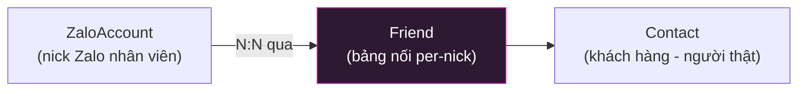
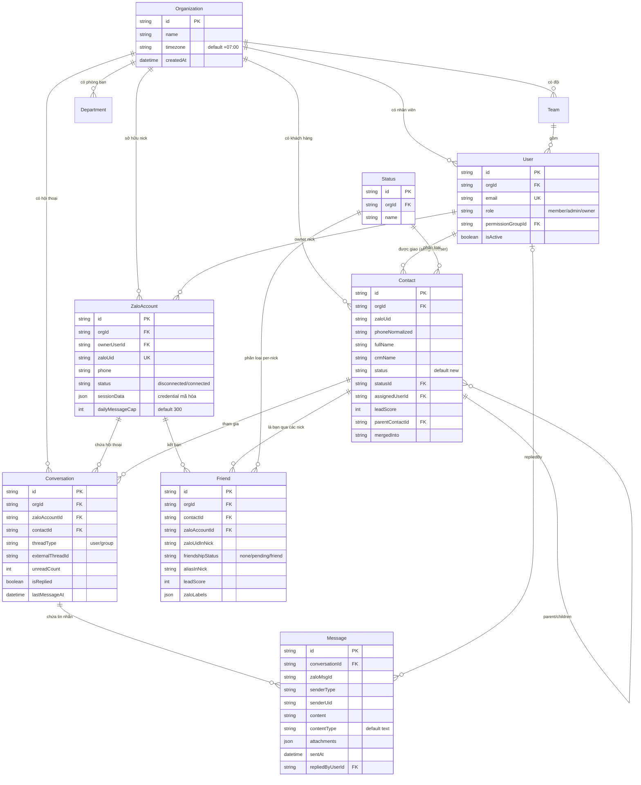
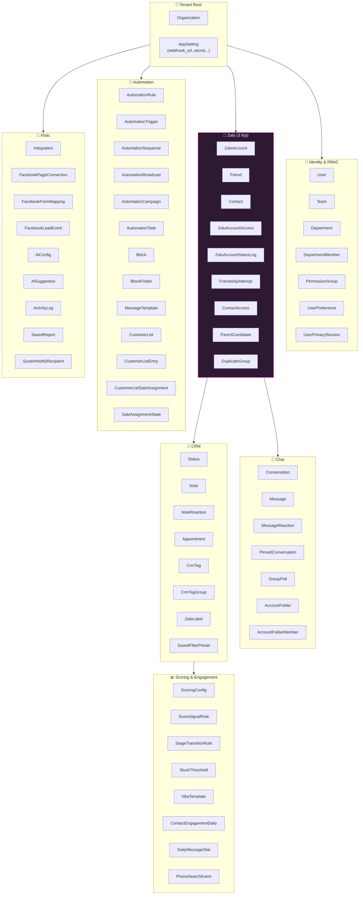
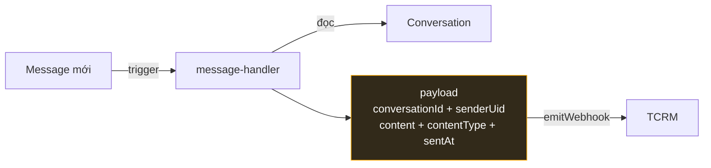
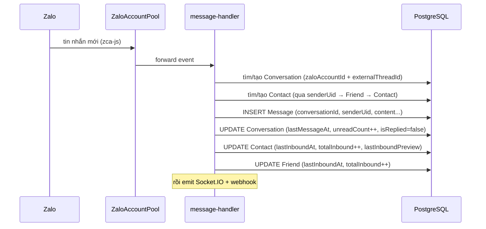

# ZaloCRM — Sơ Đồ Kiến Trúc Database

**Cập nhật:** 2026-06-05
**ORM:** Prisma · **DB:** PostgreSQL
**Tổng:** 64 model · Schema: `backend/prisma/schema/schema.prisma`

---

## 1. Nguyên Tắc Thiết Kế

### 1.1 Multi-tenant theo `orgId`
**Mọi bảng nghiệp vụ đều gắn `orgId`** → `Organization` là gốc của toàn bộ dữ liệu.
Mỗi tổ chức (khách hàng) chỉ thấy dữ liệu của mình. Đây là khóa cô lập tenant.

### 1.2 Mô hình danh tính Zalo 3 lớp ⭐
Điểm đặc biệt nhất của schema — tách **nick Zalo**, **người thật**, và **quan hệ bạn bè**:



- **`ZaloAccount`** = 1 nick Zalo cá nhân của nhân viên (đăng nhập QR)
- **`Contact`** = 1 khách hàng có thật trong CRM (gộp từ nhiều nguồn)
- **`Friend`** = bảng nối: 1 khách kết bạn với nick nào, trạng thái per-nick (score, alias, label riêng từng nick)

→ 1 khách (`Contact`) có thể là bạn của **nhiều nick** (`ZaloAccount`), mỗi quan hệ là 1 `Friend`.
Đây là cách giải bài toán "khách bị nhiều nhân viên chăm" → vẫn gom về 1 `Contact`.

### 1.3 Quy ước
- **PK:** `id` kiểu `String @default(uuid())`
- **snake_case** ở DB (`@map`), camelCase trong code
- **Soft state:** nhiều bảng có `archivedAt`, `isDeleted`, `purged`, `mergedInto`
- **Denormalized counters:** `Contact`/`Friend` lưu sẵn `totalInbound`, `leadScore`, `lastInteractionAt`... để tránh query nặng

---

## 2. ER Diagram — Lõi Trung Tâm (Core)



---

## 3. Phân Nhóm 64 Model Theo Miền



| Miền | Số model | Vai trò chính |
|---|---|---|
| **Tenant Root** | 2 | `Organization` (gốc), `AppSetting` (config webhook/key) |
| **Identity & RBAC** | 7 | User, team, phòng ban, nhóm quyền, PIN session |
| **Zalo 3 lớp** ⭐ | 9 | Nick ↔ Friend ↔ Contact + access control + dedup |
| **Chat** | 7 | Hội thoại, tin nhắn, reaction, pin, folder nick |
| **CRM** | 8 | Status, note, lịch hẹn, tag, label |
| **Scoring & Engagement** | 8 | Chấm điểm, stage, stuck, heatmap, thống kê |
| **Automation** | 13 | Rule/trigger/sequence/broadcast/block/customer-list |
| **Khác** | 10 | Integration, Facebook, AI, activity log, report |

---

## 4. Quan Hệ Quan Trọng (Giải Thích Sâu)

### 4.1 Conversation = giao điểm Nick × Khách
```
Conversation {
  zaloAccountId  → nick nào đang chat
  contactId      → với khách nào (nullable: chat nhóm chưa map)
  externalThreadId → ID thread bên Zalo
  threadType     → "user" (1-1) hoặc "group"
}
```
Mỗi hội thoại neo vào **1 nick + 1 khách**. Tin nhắn (`Message`) thuộc về `Conversation`.

### 4.2 Message — đơn vị tin nhắn
```
Message {
  conversationId  → thuộc hội thoại nào
  senderType      → ai gửi (loại)
  senderUid       → Zalo UID người gửi  ⭐ (map khách trong webhook)
  content + contentType + attachments
  sentAt
  repliedByUserId → nhân viên nào trả lời (nếu là tin gửi đi)
  sentVia         → "user" / automation...
}
```
> ⭐ **Liên quan tích hợp TCRM:** webhook `message.received` lấy `conversationId` + `senderUid`
> từ chính bảng này. Xem `plans/260605-2128-tcrm-webhook-receiver/design-doc.md`.

### 4.3 Contact — hồ sơ khách 360°
`Contact` rất "béo" (~80 cột): thông tin cá nhân, địa chỉ, social, consent (GDPR-style),
denormalized counters (`totalInbound/Outbound`, `leadScore`, `lastInboundAt`...),
và **self-relation**:
- `parentContactId` → quan hệ cha/con (vd: hộ gia đình, công ty/nhân viên)
- `mergedInto` → gộp trùng (dedup); `DuplicateGroup`/`ParentCandidate` hỗ trợ phát hiện trùng

### 4.4 Friend — trạng thái per-nick
1 `Contact` ↔ nhiều `Friend` (mỗi nick 1 dòng). Lưu riêng từng nick:
`friendshipStatus`, `aliasInNick` (tên khách đặt trong nick đó), `leadScore`, `zaloLabels`.
→ Cho phép cùng 1 khách có điểm/nhãn khác nhau ở từng nick nhân viên.

### 4.5 Access control 2 tầng
- `ZaloAccountAccess` — nhân viên nào được dùng nick nào
- `ContactAccess` — nhân viên nào xem được khách nào
→ Kết hợp `PermissionGroup` + `Department` cho RBAC chi tiết.

---

## 5. Cách Webhook Đọc Dữ Liệu (cho TCRM)



Webhook KHÔNG gửi cả hàng DB — chỉ chọn field cần: `messageId`, `conversationId`,
`senderUid`, `content`, `contentType`, `sentAt`. TCRM map `conversationId` → conversation
của mình (xem design doc).

---

## 6. Lưu Trữ & Kiểu Dữ Liệu Đáng Chú Ý

| Pattern | Ví dụ | Ghi chú |
|---|---|---|
| **Json column** | `Message.attachments`, `Contact.tags`, `Friend.zaloLabels` | Linh hoạt, không cần bảng phụ |
| **BigInt** | `Message.zaloMsgIdNum` | ID tin Zalo lớn → cần `BigInt.toJSON` patch ở `app.ts` |
| **Encrypted** | `ZaloAccount.sessionData` | Credential nick, mã hóa qua `shared/crypto` |
| **Soft delete** | `Message.isDeleted`, `ZaloAccount.purged` | Giữ lịch sử, không xóa cứng |
| **Denormalized** | `Contact.totalInbound`, `leadScore` | Tăng tốc đọc, cập nhật qua cron/handler |
| **Timezone** | `Organization.timezone` default `+07:00` | Hiển thị giờ theo org |

---

## 7. Sơ Đồ Vòng Đời Dữ Liệu Khi Có Tin Nhắn



→ 1 tin nhắn đến cập nhật đồng thời **5 bảng**: `Message` (insert) + `Conversation`,
`Contact`, `Friend` (update counters). Đây là lý do dùng denormalized counter.

---

## 8. Câu Hỏi Chưa Giải Quyết

1. Có partition/retention cho bảng `Message` không? (tin nhắn tăng nhanh nhất)
2. `ContactEngagementDaily` / `DailyMessageStat` giữ bao lâu? (bảng thống kê theo ngày)
3. Chiến lược index cho truy vấn hot: `Conversation(zaloAccountId, lastMessageAt)`, `Message(conversationId, sentAt)` đã có chưa?
4. `sessionData` mã hóa bằng thuật toán/khóa nào (key rotation)?
