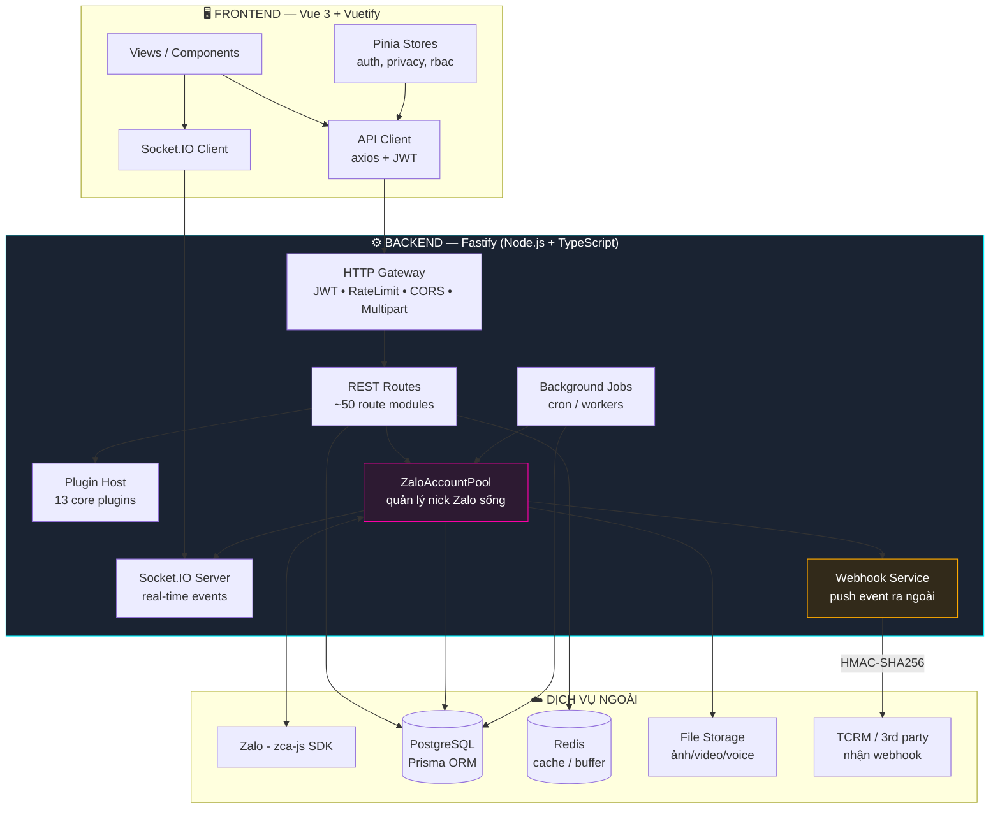
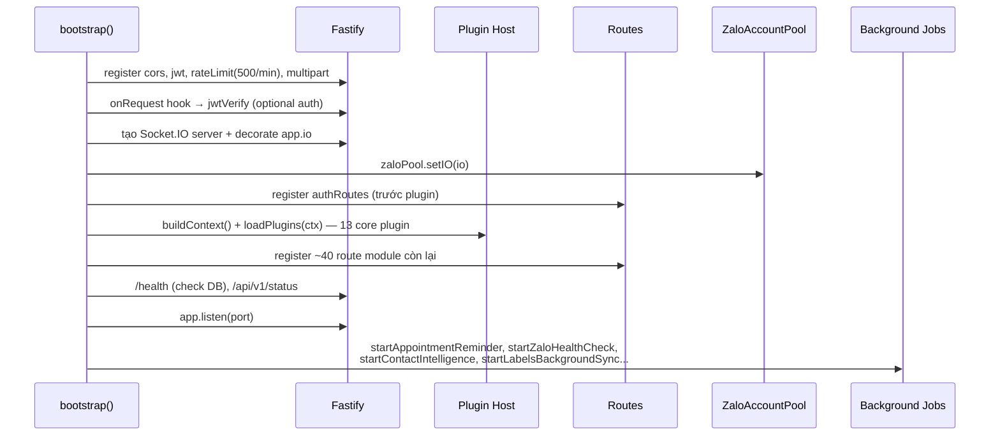
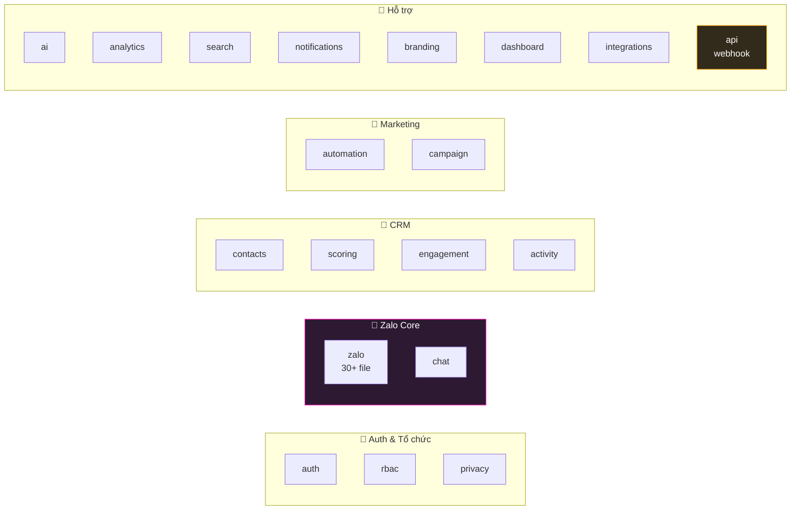
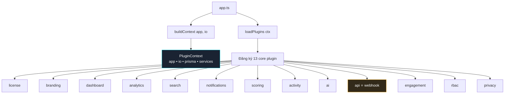
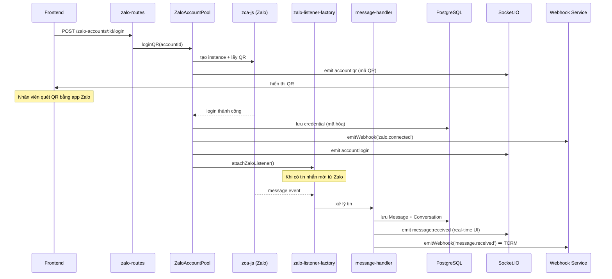
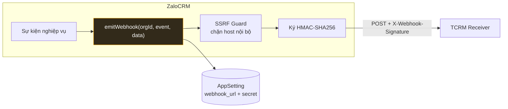
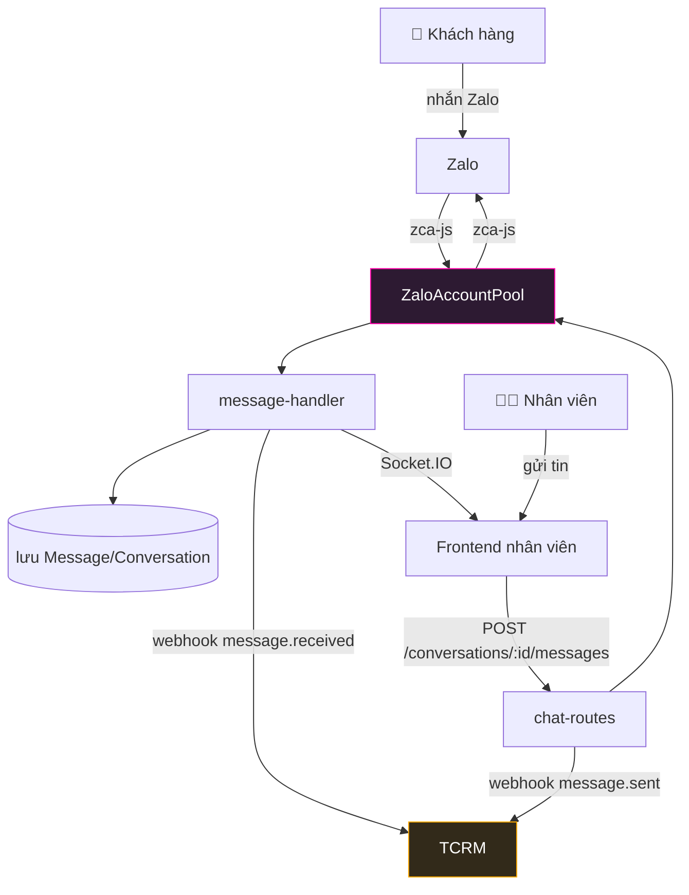

# ZaloCRM — Sơ Đồ Kiến Trúc Source Code

**Cập nhật:** 2026-06-05
**Phạm vi:** Toàn bộ source code ZaloCRM (backend Fastify + frontend Vue 3)
**Mục đích:** Giải thích kiến trúc tổng thể để hiểu, mở rộng và tích hợp (vd: TCRM)

---

## 1. Tổng Quan (High-Level)

ZaloCRM là **CRM quản lý Zalo cá nhân**: kết nối nhiều nick Zalo qua QR, nhận/gửi tin nhắn real-time,
quản lý khách hàng/lead, tự động hóa marketing, và **đẩy sự kiện ra hệ thống ngoài qua webhook**.



---

## 2. Backend — Cấu Trúc Thư Mục

```
backend/src/
├── app.ts                  # Entry point: bootstrap Fastify + Socket.IO + đăng ký routes
├── config/                 # Cấu hình env (port, jwtSecret, appUrl, DB url...)
├── core/                   # Hạ tầng plugin + license + cầu nối Zalo
│   ├── build-context.ts        # Tạo PluginContext (app, io, prisma, services)
│   ├── plugin-host.ts          # Nạp & đăng ký plugin
│   ├── license-service.ts      # Kiểm soát license/bundle
│   ├── runtime-policy.ts       # Policy mở rộng (vd automation.dispatch)
│   ├── zalo-messaging-impl.ts  # Cài đặt gửi tin (cho plugin dùng)
│   └── zalo-directory-impl.ts  # Tra cứu danh bạ Zalo
├── plugin-api/             # Interface công khai cho plugin (ZaloCrmPlugin)
├── modules/                # 20 module nghiệp vụ (chi tiết mục 3)
└── shared/                 # Tiện ích dùng chung
    ├── database/               # Prisma client
    ├── crypto/                 # Mã hóa credential
    ├── storage/                # Lưu file
    ├── phone/                  # Chuẩn hóa SĐT
    ├── event-buffer.ts         # Gom sự kiện (debounce)
    ├── redis-client.ts         # Kết nối Redis
    └── utils/                  # logger, ssrf-guard, ...
```

### 2.1 Luồng khởi động (`app.ts`)



**Điểm quan trọng:**
- **Optional auth toàn cục:** `onRequest` hook verify JWT nếu có token → gắn `request.user`. Route công khai (login, health, webhook) vẫn chạy khi không token.
- **Rate limit:** 500 req/phút, chỉ áp dụng route `/api/*`.
- **Multipart:** cho upload ảnh/video tối đa 500MB.

---

## 3. Backend — 20 Module Nghiệp Vụ



| Module | Vai trò | Điểm nhấn |
|---|---|---|
| **auth** | Đăng nhập JWT, user, team, org, setup | Token sống 7 ngày |
| **rbac** | Phòng ban, nhóm quyền, phân quyền | everyone/admin/owner |
| **privacy** | PIN gate che dữ liệu nhạy cảm | per-user session |
| **zalo** ⭐ | Quản lý nick Zalo, QR login, sync tin, friends, group, presence | 30+ file, trái tim hệ thống |
| **chat** | Hội thoại, tin nhắn, folder, preset, attachment | Socket.IO real-time |
| **contacts** | Liên hệ/lead, lịch hẹn, ghi chú, tag CRM, status | merge/parent contact |
| **scoring** | Chấm điểm lead | rule cộng/trừ điểm |
| **engagement** | Heatmap tương tác | theo giờ/ngày |
| **activity** | Nhật ký hoạt động (timeline) | audit log |
| **automation** ⭐ | Rule, template, block, sequence, trigger, broadcast, customer-list | engine event-driven |
| **campaign** | Chiến dịch gửi hàng loạt | |
| **ai** | Soạn nháp, tóm tắt, sentiment | đa provider (Anthropic/Gemini/OpenAI) |
| **analytics** | Phễu, hiệu suất đội, response-time | |
| **search** | Tìm kiếm toàn cục | |
| **notifications** | Thông báo trong app | |
| **branding** | White-label | |
| **dashboard** | Tổng quan | |
| **integrations** | Facebook/Sheets/Telegram/Zapier (INCOMING) | kéo dữ liệu vào |
| **api** ⭐ | Public API key + **Webhook (OUTGOING)** | đẩy event ra TCRM |

---

## 4. Kiến Trúc Plugin (Plugin Host)

ZaloCRM dùng **plugin architecture** để tách module thành các đơn vị nạp động.
13 plugin core được nạp qua `plugin-host.ts`, phần còn lại đăng ký trực tiếp trong `app.ts`.



**Lợi ích:** mỗi plugin nhận `PluginContext` (có sẵn `app`, `io`, `prisma`, các service) → tự đăng ký
route + handler. Cho phép bật/tắt bundle theo license và mở rộng không sửa core.

---

## 5. ZaloAccountPool — Trái Tim Hệ Thống

`zalo-pool.ts` là **singleton** quản lý các phiên Zalo SDK (`zca-js`) đang sống.



**Trách nhiệm của Pool:**
- QR login + reconnect session + lifecycle listener
- Lưu credential (mã hóa qua `shared/crypto`)
- Bắn webhook: `zalo.connected`, `zalo.disconnected`
- Bơm event real-time qua Socket.IO

**Các service vệ tinh trong module `zalo/`:**
`zalo-message-sync` (đồng bộ tin), `zalo-history-backfill` (kéo lịch sử), `friend-sync-service`
(đồng bộ bạn bè), `presence-service` (online/offline), `zalo-rate-limiter` (chống spam),
`zalo-health-check` (cron giám sát nick), `status-log-service` (nhật ký trạng thái nick).

---

## 6. Webhook OUTGOING — Cầu Nối Tích Hợp TCRM



**8 sự kiện bắn webhook** (xác nhận từ code):

| Event | Code | Khi nào |
|---|---|---|
| `message.received` | `chat/message-handler.ts:484` | Khách nhắn đến |
| `message.sent` | `chat/message-handler.ts:484` | Nhân viên gửi |
| `contact.created` | `chat/message-handler.ts:622,678` | Contact mới |
| `contact.updated` | `contacts/contact-routes.ts:528` | Sửa contact |
| `friend.status_changed` | `contacts/contact-routes.ts:957` | Đổi status |
| `friend.score_changed` | `contacts/contact-routes.ts:963` | Đổi điểm |
| `zalo.connected` | `zalo/zalo-pool.ts:180,238` | Nick login |
| `zalo.disconnected` | `zalo/zalo-pool.ts:297` | Nick logout |

> 📄 Chi tiết tích hợp TCRM: `plans/260605-2128-tcrm-webhook-receiver/design-doc.md`

---

## 7. Frontend — Vue 3 + Vuetify

```
frontend/src/
├── main.ts             # Bootstrap Vue app
├── App.vue             # Root
├── router/             # Vue Router — routes + auth guard + legacy redirect
├── stores/             # Pinia: auth, privacy, rbac
├── views/              # 27 trang (Chat, Contacts, Automation, Settings...)
├── components/         # 18 nhóm component (settings, rbac, ai, facebook...)
├── composables/        # Logic tái dùng (vd use-settings-nav.ts)
├── api/                # API client (axios)
├── layouts/            # DefaultLayout (sidebar + nav)
├── plugins/            # Vuetify, plugin-api UI
└── constants/          # Hằng số UI
```

```mermaid
graph TB
    main[main.ts] --> app[App.vue]
    app --> router[Vue Router]
    router --> guard{Auth Guard}
    guard -->|chưa login| login[Login]
    guard -->|đã login| layout[DefaultLayout<br/>sidebar + nav]
    layout --> views[27 Views]
    views --> stores[Pinia Stores]
    views --> apiclient[axios API Client]
    apiclient -->|Bearer JWT| backend[Backend REST]
    views -.Socket.IO.-> backend

    style layout fill:#1a2332,stroke:#00F2FF,color:#fff
```

**Đặc điểm:**
- **Auth guard** chặn route cần đăng nhập, redirect legacy path (vd `/api-settings` → `/settings/dev/api`).
- **Settings** tổ chức 6 nhóm × 19 mục qua `use-settings-nav.ts`, lọc theo vai trò.
- **Real-time:** Socket.IO client nghe `message:received`, `account:qr`, `account:login`, `chat:typing`.

---

## 8. Luồng Dữ Liệu Đầu-Cuối (End-to-End)



---

## 9. Công Nghệ (Tech Stack)

| Lớp | Công nghệ |
|---|---|
| **Backend** | Node.js, TypeScript, Fastify, Socket.IO |
| **ORM / DB** | Prisma, PostgreSQL |
| **Cache** | Redis (event buffer, cache) |
| **Zalo SDK** | zca-js (interop CJS) |
| **Auth** | JWT (@fastify/jwt), 7 ngày |
| **Frontend** | Vue 3, Vuetify, Pinia, Vue Router, axios, Vite, PWA |
| **AI** | Anthropic / Gemini / OpenAI-compat |
| **Bảo mật** | HMAC-SHA256 webhook, SSRF guard, crypto credential, PIN gate |

---

## 10. Câu Hỏi Chưa Giải Quyết

1. Redis dùng cho cache hay cả pub/sub đa instance? (ảnh hưởng scale ngang)
2. Storage là local disk hay S3-compatible? (xem `shared/storage`)
3. Plugin bundle tùy chọn (ngoài 13 core) gồm những gì khi có license?
